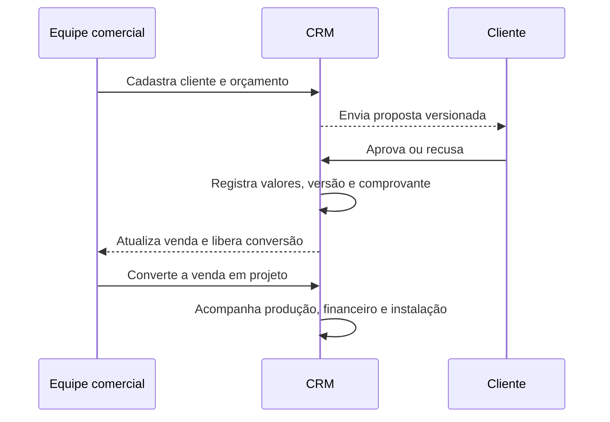
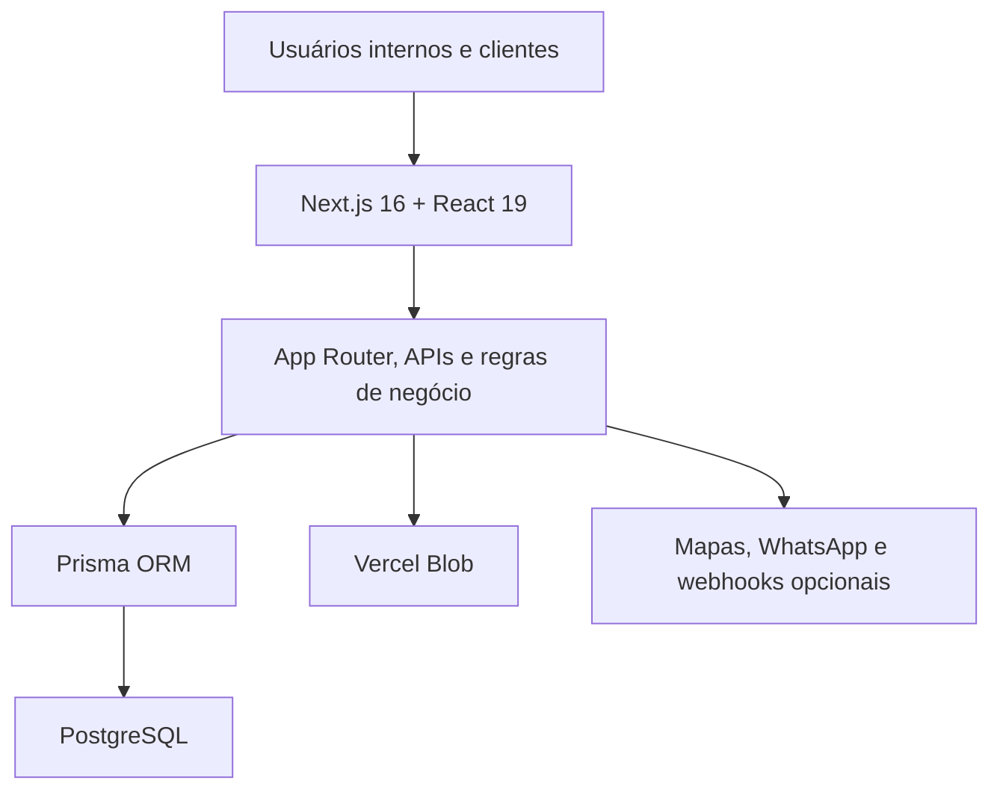

  

# Vertex Móveis — CRM e Gestão

Estudo de caso de um sistema interno criado para centralizar o ciclo completo de vendas e execução de móveis planejados: do primeiro cadastro ao orçamento, aprovação, projeto, produção, instalação, financeiro e pós-venda.

- **Aplicação:** [vertex-moveis-gestao.vercel.app](https://vertex-moveis-gestao.vercel.app) — acesso interno e restrito
- **Código-fonte:** [vertexmoveis/vertex-moveis-gestao](https://github.com/vertexmoveis/vertex-moveis-gestao)
- **Stack principal:** Next.js, React, TypeScript, PostgreSQL e Prisma
- **Idioma:** Português do Brasil

> Este repositório documenta o projeto sem duplicar o código-fonte e sem publicar telas, credenciais ou dados de clientes.

## Resumo executivo

A operação de uma marcenaria envolve informações comerciais, técnicas, financeiras e logísticas que podem se dispersar entre conversas, planilhas e documentos. O CRM foi desenvolvido para reunir essas etapas em um fluxo único, preservar o histórico das decisões e dar visibilidade às próximas ações da equipe.

O sistema atende vendas, projetos, produção, compras, instalações, recebimentos e pós-venda. Portais externos permitem que o cliente aprove propostas, acompanhe o andamento e aceite contratos sem receber acesso às áreas internas.

## Minha contribuição

**Eduardo Alves Martins** liderou tecnicamente o projeto e realizou o desenvolvimento completo do sistema, incluindo:

- levantamento e tradução das regras da operação para software;
- arquitetura da aplicação e modelagem do banco de dados;
- implementação do backend, frontend e integrações;
- autenticação, autorização, segurança e trilhas de auditoria;
- cálculos comerciais e financeiros com precisão monetária;
- testes automatizados, rotinas de backup e validações operacionais;
- configuração de entrega contínua, publicação e manutenção técnica.

O design visual foi desenvolvido em colaboração com o irmão de Eduardo.

## Problema e solução

| Necessidade operacional | Solução implementada |
| --- | --- |
| Informações espalhadas | Cadastro central de clientes, orçamentos, projetos e histórico |
| Dificuldade para acompanhar prazos | Dashboard, alertas, calendário e próximas ações por prioridade |
| Retrabalho após a venda | Conversão do orçamento em projeto sem redigitação |
| Produção sem visão compartilhada | Kanban por etapa, ambiente, bloqueio e capacidade semanal |
| Financeiro separado da execução | Parcelas, recebimentos, despesas, custos e rentabilidade por projeto |
| Aprovações informais | Links versionados, fotografia da proposta e registro do aceite |
| Arquivos dispersos | Armazenamento privado, categorias, validação e histórico no projeto |
| Pós-venda sem acompanhamento | Garantia, chamados, agenda e registro da solução |

## Fluxo principal

## Arquitetura

A aplicação concentra interface, APIs e regras de negócio no ecossistema Next.js. O acesso aos dados passa pelo Prisma, enquanto arquivos privados ficam no Vercel Blob. Integrações externas são opcionais e dependem de configuração fora do repositório.

## Módulos principais

| Módulo | Responsabilidade |
| --- | --- |
| Dashboard | Indicadores, atrasos, alertas, atividades e próximas ações |
| Clientes | Cadastro, histórico, busca, mapa e solicitações relacionadas a dados |
| Orçamentos | Ambientes, móveis, acabamentos, custos, descontos e condições de pagamento |
| Propostas | Documentos comerciais, versões e aprovação pública controlada |
| Projetos | Ambientes, cronograma, materiais, arquivos, contrato, instalação e garantia |
| Produção | Kanban, bloqueios, prazos por etapa e capacidade semanal |
| Financeiro | Recebimentos, parcelas, custos, despesas, recibos e rentabilidade |
| Compras e estoque | Materiais, fornecedores, cotações, pedidos, reservas e reposição |
| Calendário | Entregas, instalações, equipes, veículos e eventos financeiros |
| Configurações | Usuários, preços, materiais, capacidade, backups e saúde operacional |

## Decisões de engenharia

### Valores monetários precisos

Valores financeiros são armazenados com precisão decimal. Ao recalcular um projeto, recebimentos já confirmados são preservados e somente os lançamentos pendentes são ajustados.

### Aprovações versionadas

Cada envio registra uma fotografia dos itens e valores daquela versão. Um novo envio invalida links anteriores, evitando que o cliente aceite uma proposta desatualizada.

### Separação entre áreas públicas e internas

Links externos mostram apenas o necessário para aprovação ou acompanhamento. Custos, lucro, observações internas, pagamentos e arquivos privados permanecem protegidos.

### Controle de acesso no servidor

Administrador, gerente e consulta possuem permissões diferentes. As verificações de função e propriedade são feitas no servidor, inclusive para clientes, orçamentos e projetos.

### Arquivos tratados como entrada não confiável

O upload valida tamanho, tipo e assinatura interna do arquivo. PDFs recebem verificações adicionais, e um scanner externo pode complementar a análise quando configurado.

### Backup com teste de restauração

Os backups são criptografados com AES-256-GCM, verificados e restaurados em ambiente isolado para conferir sua integridade. A chave permanece fora do código-fonte.

### Rotinas idempotentes

Lembretes e integrações usam chaves de deduplicação para evitar mensagens repetidas. Eventos de entrega, leitura e falha atualizam a tentativa existente.

## Segurança e privacidade

- autenticação por credenciais e senha protegida por bcrypt;
- autenticação em duas etapas opcional por TOTP;
- sessões com expiração e possibilidade de revogação;
- limitação de requisições e tentativas de login;
- autorização por perfil e propriedade do registro;
- tokens públicos aleatórios, com validade, revogação e armazenamento protegido;
- cabeçalhos de segurança, CSP com nonce e HSTS em produção;
- proteção contra fórmulas executáveis em exportações CSV;
- validação de dados com Zod;
- exclusão lógica antes da remoção definitiva;
- registros de atividades, pagamentos, aprovações e eventos de segurança;
- rotinas para exportação, correção, anonimização ou exclusão de dados vinculados ao cliente.

## Tecnologias

| Área | Tecnologias |
| --- | --- |
| Aplicação | Next.js 16, React 19 e TypeScript |
| Interface | Tailwind CSS, React Hook Form, Recharts, dnd-kit e Lucide |
| Dados | PostgreSQL e Prisma ORM |
| Autenticação | NextAuth, bcrypt e TOTP |
| Validação | Zod |
| Arquivos | Vercel Blob |
| Mapas | Leaflet e OpenStreetMap |
| Testes | Node Test Runner e Playwright |
| Entrega | GitHub Actions e Vercel |

## Qualidade e operação

O projeto mantém rotinas para:

- lint e build de produção;
- testes unitários, de segurança e de navegador;
- auditoria de dependências;
- aplicação controlada de migrações;
- backup diário e teste periódico de restauração;
- verificação de disponibilidade;
- abertura e encerramento automatizado de alertas operacionais.

Os comandos e a implementação podem ser consultados no [repositório oficial](https://github.com/vertexmoveis/vertex-moveis-gestao).

## Limites deste estudo de caso

- não são publicados dados, valores ou documentos de clientes;
- não são fornecidas credenciais de demonstração;
- não são reproduzidas capturas das áreas internas;
- o código permanece no repositório oficial da empresa;
- nenhuma métrica de negócio é declarada sem uma medição reproduzível;
- integrações externas dependem de contas e credenciais próprias.

## Autoria

**Liderança técnica e desenvolvimento:** [Eduardo Alves Martins](https://github.com/Alves975)

**Design visual:** colaboração do irmão de Eduardo

[LinkedIn](https://www.linkedin.com/in/eduardo-alves-martins-b5604b371)

---

Estudo de caso baseado no sistema desenvolvido para a operação da **Vertex Móveis**.
